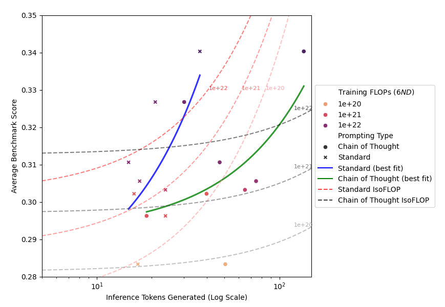
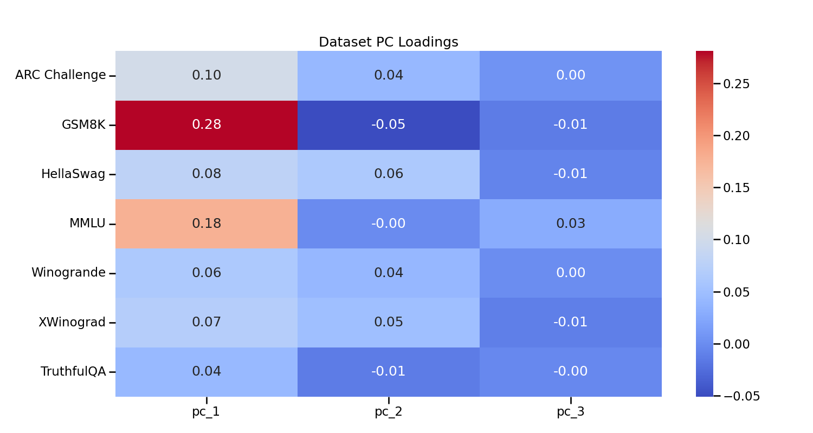
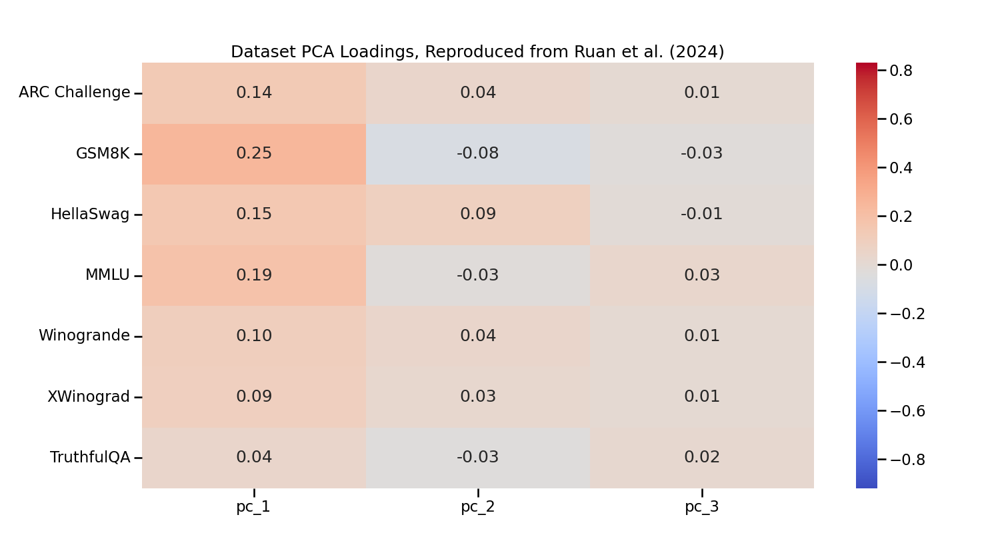

# When to Think Step by Step: Computing the Cost-Performance Trade-offs of Chain-of-Thought Prompting
A systematic study of chain-of-thought prompting and other inference optimization strategies across model scales and architectures.

## Overview
This repository contains code, data, and evaluation scripts for analyzing the cost-performance tradeoffs of large language model inference optimizations. We provide tooling to:
* Evaluate models with different prompt strategies (standard, chain-of-thought, etc.)
* Analyze performance scaling across model sizes and training data levels
* Calculate cost-efficiency metrics for different inference approaches
* Reproduce our experimental results

## Key Findings:

* Chain-of-thought benefits emerge differently when scaling model size vs training data

* Inference-compute scaling for chain of thought models is due to effects of larger model size; for standard models, it is due to use of more inference tokens

* For many inference scenarios, CoT is more compute-efficient than training larger models

* Code reasoning tasks play an outsized role in previous capability analyses
* Observational Scaling Laws are dependent on benchmark variety and coverage, as opposed to model capability



See [our paper](<When to Think Step By Step - Manglik, Choudhri.pdf>) for detailed analysis.

## Getting Started:
### Installation
```bash
git clone https://github.com/EleutherAI/lm-evaluation-harness.git
cd lm-evaluation-harness
pip install -e .
cd ..
git clone https://github.com/AkshayM21/obs-scaling-inference-opts.git
cd obs-scaling-inference-opts
pip install -e .
```

### Running Evaluations
Specify any optimizations you want, of cot (Chain of Thought), beam (Beam Search) and regular (No Optimizations). Specify sample to save samples of a certain percentage of your runs. 

Run evaluate_vllm instead of evaluate for vLLM optimization.

Sample evaluation:
```bash
python -m evaluate_test --optimization={cot,beam,regular}
```
```bash
python -m evaluate_vllm --optimization={cot,beam,regular} --sample=0.05
```

To run on multi-GPU without vLLM, call accelerate:
```bash
accelerate launch --multi_gpu --num_processes={num_processes} --mixed_precision bf16 --dynamo_backend inductor -m evaluate --optimization={regular,beam,cot} 
```

### Analysis
Scripts to analyze results and generate plots are in the `/analysis` subdirectory. Call scripts as:
```bash
python -m analysis/granular_analysis.py
python -m analysis/isoflop.py
```

### Project Structure
```
obs-scaling-inference-opts/
├── evaluate/                 # Deprecated evaluation script
│   └── __main__.py           
├── evaluate_test/            # Accelerate-compatible GPU evaluation scripts
│   └── __main__.py           
├── evaluate_vllm/            # vLLM-specific evaluation
│   └── __main__.py           # vLLM evaluation logic
├── analysis/                 # Analysis scripts
│   ├── benchmark.py          # Basic benchmark analysis
│   ├── cost.py               # Cost profiling
│   └── granular_analysis.py  # Main inference optimization analysis
|   └── isoflop.py            # IsoFLOP inference optimization analysis
├── config/                   # Configuration files for lm-eval-harness
│   └── cot/                  # Chain of thought prompts
├── results/                  # Results storage
│   ├── toks_generated.csv    # Token generation data
│   └── train_equivalent_flops.csv
├── samples/                  # Model output samples
│   ├── cot/                  # Chain of thought samples
│   └── regular/              # Standard samples
├── requirements.txt          # Project dependencies
└── README.md                 # Project documentation
```

## Authors

* Akshay Manglik - Columbia University
* Aman Choudhri - Columbia University

## Acknowledgements
Thanks to Nikhil Sardana and Jacob Portes of Mosaic Research for guidance on language model evaluation and inference-aware scaling laws.
Special thanks to Kaoutar El Maghroui for her mentorship throughout
Columbia’s COMS6998: High-Performance Machine Learning course. A further acknowldgement to Google and the TPU Research Cloud for providing compute resources.
