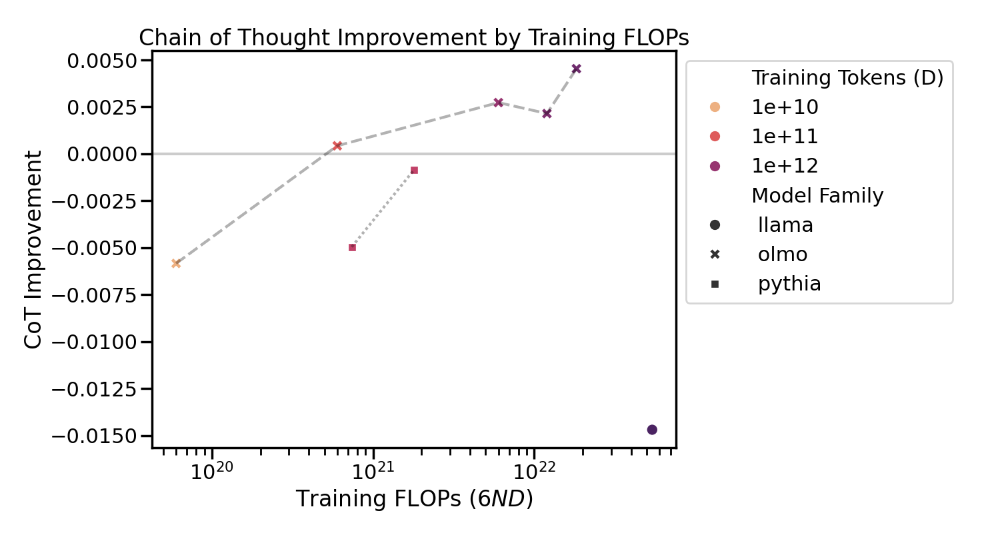
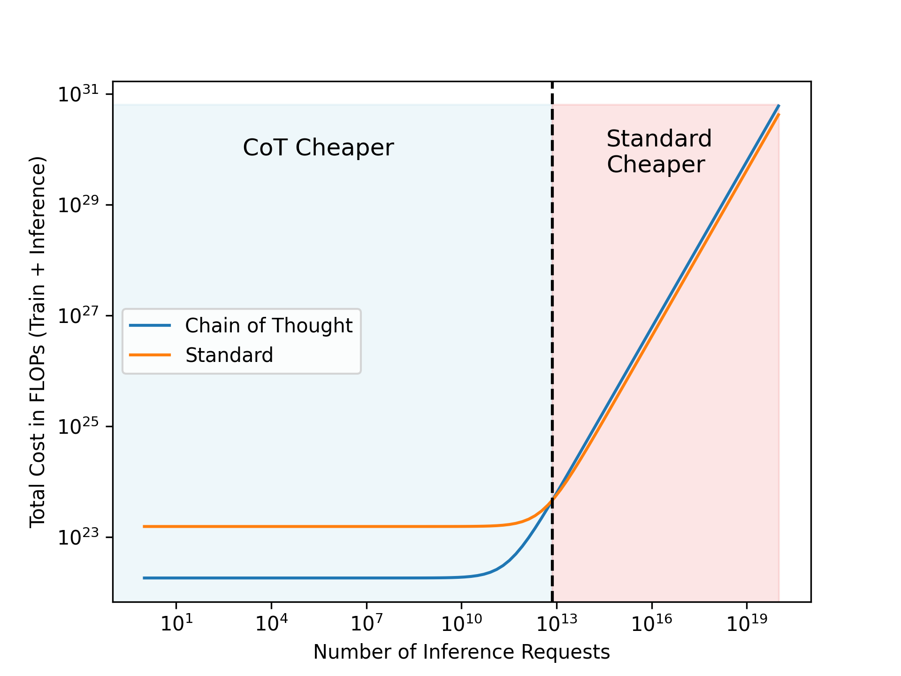

# Granular Analysis of LLM Inference Optimizations
A systematic study of chain-of-thought prompting and other inference optimization strategies across model scales and architectures.

## Overview
This repository contains code, data, and evaluation scripts for analyzing the cost-performance tradeoffs of large language model inference optimizations. We provide tooling to:
* Evaluate models with different prompt strategies (standard, chain-of-thought, etc.)
* Analyze performance scaling across model sizes and training data levels
* Calculate cost-efficiency metrics for different inference approaches
* Reproduce our experimental results

## Key Findings:

* Chain-of-thought benefits emerge differently when scaling model size vs training data

* For many inference scenarios, CoT is more compute-efficient than training larger models

* Code reasoning tasks play an outsized role in previous capability analyses

See our paper for detailed analysis.

## Getting Started:
### Installation
```bash
git clone https://github.com/yourusername/obs-scaling-inference-opts.git
cd obs-scaling-inference-opts
pip install -r requirements.txt
```

### Running Evaluations
Basic:
```bash
python -m evaluate --model hf \
--model_args pretrained=EleutherAI/pythia-1b-deduped \
--tasks mmlu,hellaswag,xwinograd,winogrande,truthfulqa_mc1,arc_challenge,gsm8k
```
Chain of Thought:
```bash
python -m evaluate --model hf \
--model_args pretrained=EleutherAI/pythia-1b-deduped \
--tasks hellaswag_cot,arc_challenge_cot,truthfulqa_cot,xwinograd_cot,winogrande_cot,gsm8k_cot_zeroshot,mmlu_flan_cot_zeroshot \
--optimization cot
```

### Analysis
Scripts to analyze results and generate plots are in the `/analysis` subdirectory. Call scripts as:
```bash
python -m analysis.granular_analysis
```

## Citation
If you use this code in your research, please cite:
```
@article{manglik2024granular,
  title={Granular Analysis of LLM Inference Optimizations},
  author={Manglik, Akshay and Choudhri, Aman},
  journal={arXiv preprint arXiv:2401.05618},
  year={2024}
}
```

## Authors

* Akshay Manglik - Columbia University
* Aman Choudhri - Columbia University

## Acknowledgements
Thanks to Nikhil Sardana and Jacob Portes of Mosaic Research for guidance on language model evaluation and inference-aware scaling laws.
Special thanks to Kaoutar El Maghroui for her mentorship throughout
Columbia’s COMS6998: High-Performance Machine Learning course. A further acknowldgement to Google and the TPU Research Cloud for providing compute resources.
